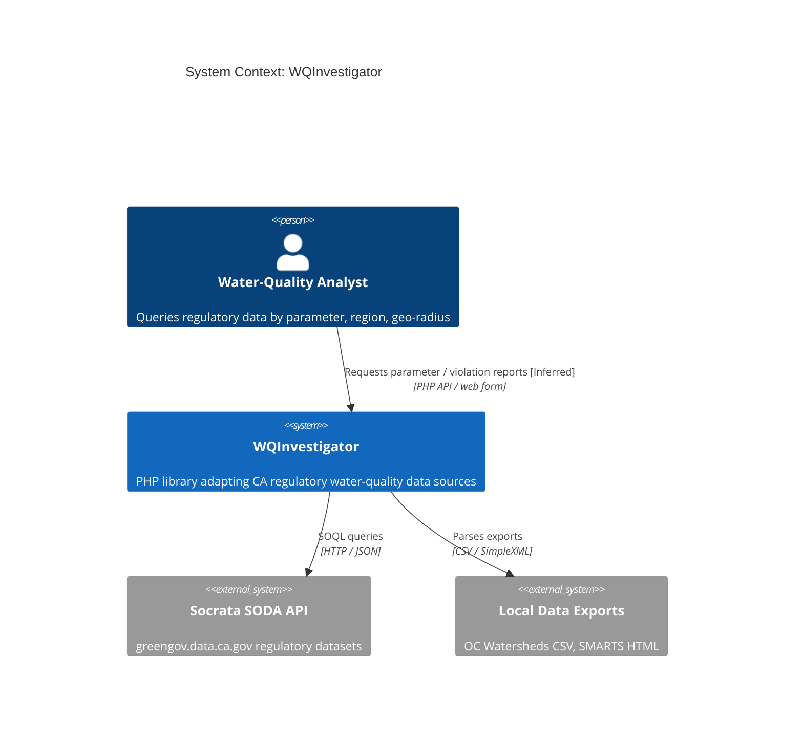

# MRI Analysis Complete — wqinspector (WQInvestigator)

Completed: 2026-07-09
Codebase: 16 source files (14 PHP analyzable), ~640 lines of code

## What We Accomplished

This campaign analyzed all 14 source files of the WQInvestigator library across 3 topics,
extracting 60 business rules at 76% Confirmed confidence and producing per-file analysis for
every source file. It confirmed — with file:line evidence and a concrete untrusted-input path —
a SOQL injection vulnerability that had only been flagged provisionally before, and surfaced a
companion reflected-XSS flaw and a set of dependency/upgrade hazards. The corpus now provides
complete coverage of the library's query-construction, retrieval, and reference-usage logic.

- 3 business domains analyzed: Domain Adapters, Support Infrastructure, Examples / Entry Points
- 14 source files with individual analysis docs
- 60 business rules extracted
- 2 external APIs mapped (Socrata SODA: 64tg-janj, xsyg-h4ri; phpFastCache)
- 6 security findings (2 SOQL injection, 1 reflected XSS, 1 XXE version-hazard, 2 advisory)
- 2 dead code candidates identified
- 12 SME questions requiring domain expert input

**Data sources:** domain-profile.yaml (project, technology), analysis prose (actors,
integrations). The analyst actor is [Inferred] from the example web form; external systems are
[Confirmed] from code.

## Quality Assessment

| Dimension | Score | Threshold | Status |
|-----------|-------|-----------|--------|
| File Coverage | 87.5% (14 of 16 files); 100% (14 of 14 source) | 90% | WARN* / PASS |
| Topic Coverage | 3 topics (3 analysis + 3 rollup) | — | PASS |
| Completeness | ~95% (14 of 14 within golden baselines) | 80% | PASS |
| Compliance | 100% (23 of 23 artifacts valid) | 95% | PASS |
| Currency | 100% | 90% | PASS |
| Clarity | 0% (0 of 12 SME questions resolved — pre-review) | 85% | WARN |
| Stability | Baseline (first run) | ≥0.0 | PASS |

\* File-coverage WARN is a denominator artifact — the 2 non-analyzed files are
`.gitkeep`/`.gitignore` placeholders. 100% of source is analyzed.

Overall: **PASS** — full source coverage, healthy confidence distribution, all schema checks
pass. The only WARNs are the expected pre-review SME-question backlog and a false-negative file
count. A clear, high-value security finding is confirmed and ready for SME triage.

## Your Analysis Corpus

| Domain | Files | Rules | Confidence | Start Here |
|--------|-------|-------|------------|------------|
| Domain Adapters | 4 | 27 | 71% | research/domain-adapters/DOMAIN-BRIEF.md |
| Support Infrastructure | 5 | 20 | 79% | research/support-infrastructure/DOMAIN-BRIEF.md |
| Examples / Entry Points | 5 | 13 | 82% | research/examples-and-entry-points/DOMAIN-BRIEF.md |

## What To Read Next

**For decision-makers:** → EXECUTIVE-READOUT.md (20 min)
**For architects:** → Browse research/ — each topic has a DOMAIN-BRIEF.md
**For developers / security:** → research/domain-adapters/DOMAIN-BRIEF.md, then per-file docs

## Deliverable Map

| File | For | Time | Contains |
|------|-----|------|----------|
| DELIVERY-SUMMARY.md | Everyone | 2 min | This report card |
| EXECUTIVE-READOUT.md | CTO / VP Eng | 20 min | Key findings, risks, recommendations |
| synthesis/QUALITY-SCORECARD.md | Methodology | 5 min | 6C quality metrics and per-topic breakdown |
| README.md | Navigation | 1 min | Audience-based navigation hub |
| analysis/consolidated-report.md | Tech leads | 10 min | Full merged findings + action items |
| synthesis/sme-questions.md | SMEs | 5 min | 12 prioritized open questions |
| research/{topic}/DOMAIN-BRIEF.md | Architects | 10 min each | Per-domain roll-up |
| research/{topic}/*-analysis.md | Developers | Varies | Per-file deep analysis |
