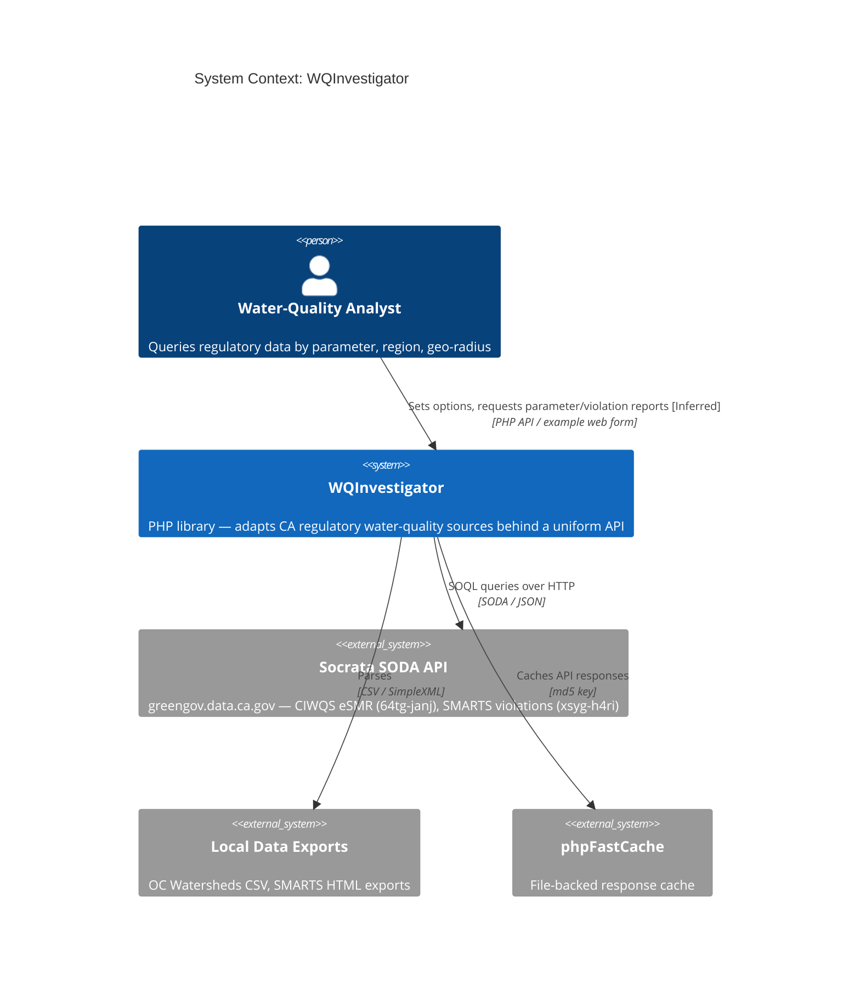
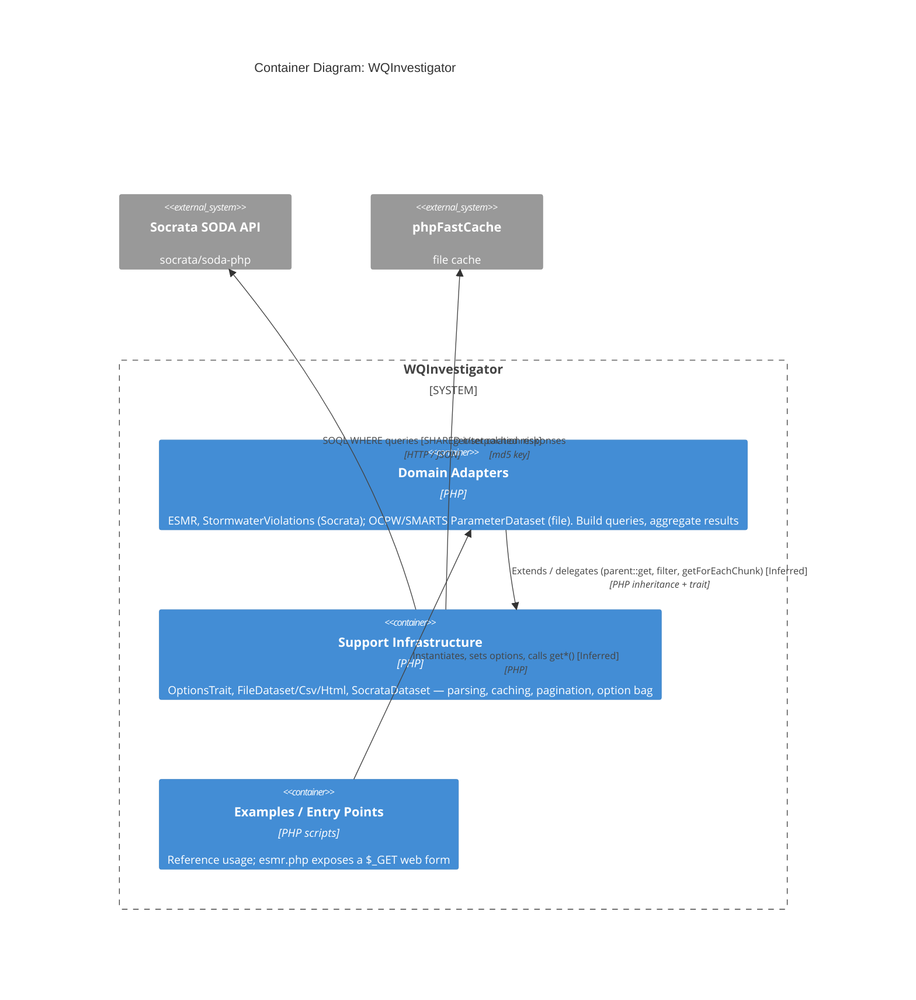

# Executive Readout — wqinspector (WQInvestigator)

## Summary

WQInvestigator is a small (16-file, ~640 LOC) single-tenant PHP library that adapts four
California regulatory water-quality data sources — CIWQS eSMR, OC Watersheds CSV, SMARTS HTML,
and SMARTS stormwater violations — behind a uniform query/result API. It is bundled into the
`instance-cloud` deployment (cloudcompli org). This campaign analyzed all 14 source files across
3 topics using the MRI methodology, extracting 60 business rules with 76% Confirmed confidence.
The library has **no database**; data comes from the Socrata SODA HTTP API (two hardcoded
datasets on `greengov.data.ca.gov`) and local CSV/HTML file parsing.

What we found: the code is small, clean, and well-structured, but it carries a **confirmed SOQL
injection vulnerability** in its two Socrata adapters — and, critically, the library's own
reference example demonstrates that vulnerability being fed directly from untrusted HTTP request
parameters, alongside a reflected cross-site-scripting (XSS) flaw in the same file. These are
the dominant risks. Secondary concerns are unpinned Composer dependencies (a supply-chain and
upgrade hazard), an abandoned test framework, and a couple of minor correctness and
maintainability issues.

What we recommend: treat the injection and XSS as the priority. Because both Socrata adapters
share a single option-bag chokepoint (`OptionsTrait`), a validation/escaping layer added in one
place neutralizes the injection across the whole library. Then confirm two SME questions that
gate severity — whether option values are user-supplied in production and whether the
`examples/` scripts are deployable — before scoping the remediation.

**Data sources:** domain-profile.yaml (project, technology, external dependencies),
DOMAIN-BRIEF.md prose (actors, integrations). The analyst actor is [Inferred] from the
example web form; external systems are [Confirmed] from code.

## Key Findings

### Finding 1: Confirmed SOQL injection, reachable from untrusted HTTP input
Both Socrata adapters build SOQL WHERE clauses by string-interpolating option values with no
escaping — `CIWQS\ESMR::compileWhere()` (src/CIWQS/ESMR.php:24,28) and
`SMARTS\StormwaterViolations::compileWhere()` (src/SMARTS/StormwaterViolations.php:24,28,33).
The `violation_type` array-element clause and the bare-numeric `within_circle` clause are the
widest surfaces. This was flagged in a prior light pass; the campaign **confirms it with
file:line evidence and a concrete exploit path**: `examples/esmr.php:57-61` feeds
`$_GET['latitude'|'longitude'|'radius']` straight into the `within_circle` option. Because the
example is the library's reference usage pattern, this is a demonstrated data flow, not a
hypothetical one.
Confidence: [Confirmed]
Business implication: If option values are user-supplied in any production consumer, an attacker
can alter or exfiltrate Socrata queries. Severity hinges on SME confirmation (see Decision Gates).

### Finding 2: Reflected XSS in the reference example
`examples/esmr.php:51-55` echoes raw `$_GET` values into an inline `<script>` block (and line 28
into HTML) with no output encoding. If this script is deployed/reachable, it is a live reflected
XSS.
Confidence: [Confirmed]
Business implication: Session/credential theft or drive-by script execution in any environment
where the example is served.

### Finding 3: Supply-chain and upgrade hazards in dependency configuration
`composer.json` pins `phpfastcache/phpfastcache` and `socrata/soda-php` to `"*"` (wildcard),
producing non-reproducible builds where any transitive major bump can silently break the
library. The dev dependency `phpunit 4.0.*` is abandoned and incompatible with modern PHP
runtimes, and no PHP version constraint is declared.
Confidence: [Confirmed]
Business implication: Fragile builds and a blocked path to modern CI/testing — a modernization
prerequisite.

### Finding 4: Latent correctness bug in query merging
Both Socrata adapters' `makeQueryParameters()` reference `$params['where']` (missing `$` sigil)
in the caller-`$where` merge branch, while the guard checks `$params['$where']` (ESMR.php:38,
StormwaterViolations.php:44). The branch appears never to have executed (it is effectively dead
code) — which is why the bug has survived.
Confidence: [Inferred]
Business implication: Low today (unreached), but a trap for any future caller that supplies a
custom `$where`.

### Finding 5: The architecture makes remediation cheap
The injection-relevant values all flow through a single `OptionsTrait` option bag mixed into
both dataset roots. Adding validation/escaping there is a one-place fix that covers both
adapters. The codebase has zero dynamic-code patterns (no eval/reflection) and is fully
statically resolvable within its own boundary, so it is easy to reason about and change safely.
Confidence: [Confirmed]
Business implication: The highest-severity risk has a low-effort, low-blast-radius fix.

## Architecture

**Data sources:** execution-state.yaml (topics as containers), domain-profile.yaml
(technology, external dependencies), DOMAIN-BRIEF.md prose (internal relationships). No
coupling-matrix or entity manifest exists (no database); container relationships are [Inferred]
from analysis prose and inheritance structure.

## Risk Register

| Risk | Likelihood | Impact | Mitigation | Source Topics |
|------|-----------|--------|------------|---------------|
| SOQL injection via unescaped option interpolation | H (if user-supplied) | H | Parameterize/escape SOQL; validate at OptionsTrait chokepoint | domain-adapters, examples |
| Reflected XSS in esmr.php | M (deployment-dependent) | H | Output-encode `$_GET`; mark example non-deployable | examples |
| Unpinned dependencies (`"*"`) break builds | M | M | Pin to explicit version ranges; add lockfile discipline | (composer.json) |
| Abandoned phpunit 4 blocks modern CI | H | L | Upgrade to phpunit 9/10; declare PHP version | (composer.json) |
| XXE via simplexml_load_file (version-dependent) | L | M | Disable entity loading / LIBXML_NONET if input untrusted | support-infrastructure |
| `$params['where']` merge typo | L | M | Fix or remove dead branch | domain-adapters |
| Pagination termination contract fragility | L | M | Verify soda-php empty/error-page behavior | support-infrastructure |

## Recommended Path Forward

Effort uses T-shirt sizing (relative magnitude, not calendar time).

### Phase 1: Neutralize the injection + XSS (estimated)
- Add input validation/escaping for SOQL option values at the `OptionsTrait` chokepoint, covering
  both `compileWhere()` implementations (domain-adapters).
- Output-encode `$_GET` in `examples/esmr.php`, or clearly mark all `examples/` as non-deployable.
- Effort: **S**
- Relative complexity: single change surface; small, well-isolated code; no database or dynamic
  dispatch to reason about.

### Phase 2: Dependency + build hygiene (estimated)
- Pin `composer.json` dependencies to explicit ranges; add/refresh `composer.lock`; declare a
  supported PHP version; retire phpunit 4 in favor of a current release.
- Effort: **S/M**
- Relative complexity: mechanical, but requires validating the library against pinned
  soda-php/phpFastCache versions.

### Phase 3: Correctness + maintainability cleanup (estimated)
- Fix/remove the `$params['where']` dead branch; harden `HtmlDataset` XXE; decide on numeric
  coercion of non-numeric results; unify the two near-identical `ParameterDataset` file adapters.
- Effort: **S**
- Relative complexity: low-risk local edits once SME questions are answered.

## Decision Gates

- [ ] Gate 1: SME confirms whether injection-relevant option values (`within_circle`,
      `region_code`, `after`, `before`, `violation_type`) are ever user-supplied in production.
- [ ] Gate 2: SME confirms whether any `examples/` script is deployed/reachable (sets XSS +
      injection severity).
- [ ] Gate 3: Architecture review of the proposed OptionsTrait validation layer before implementation.

## Methodology

This analysis was conducted using the MRI (Codebase Analysis Methodology) framework.
Quality assessment: See synthesis/QUALITY-SCORECARD.md for detailed 6C metrics.
Confidence calibration: All findings carry [Confirmed], [Inferred], or [Uncertain] markers.
Effort estimates use T-shirt sizing (S/M/L/XL) to convey relative magnitude without false precision.
For the complete research corpus, see the research/ directory — each topic has a DOMAIN-BRIEF.md.
